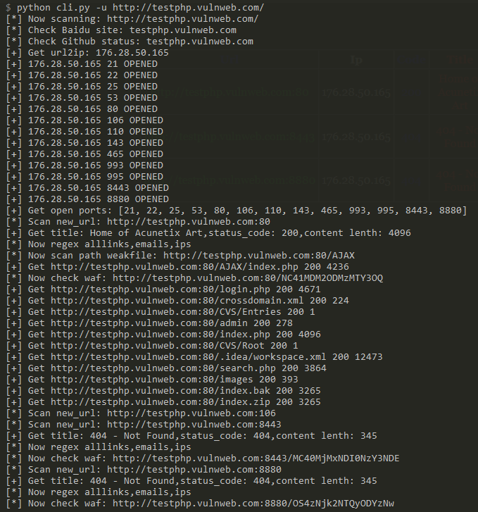
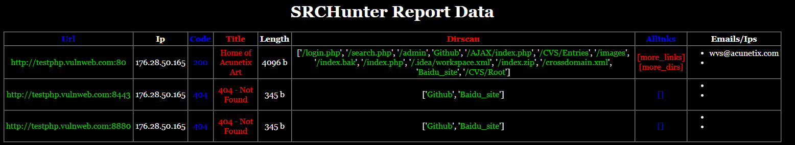
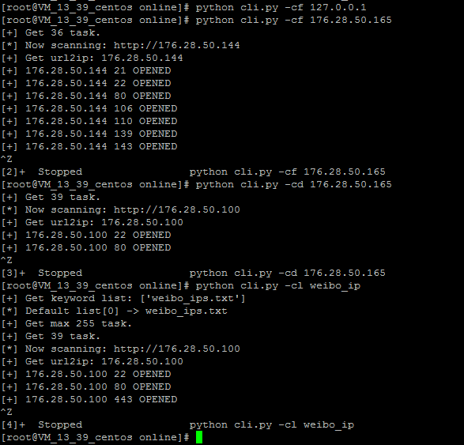

SRCHunter，中文名字"赏金猎人"，一款适合信息安全从业者前期信息收集的扫描器，整合渗透测试经验，把重复性工作模块化、系统化、自动化，适合外围打点人员、蓝军使用，行动代号"opSRC"。

## 功能

```python
python cli.py -s target | 搜索目标文件
python cli.py -a target.com | 自动收集子域名扫描
python cli.py -u http://www.target.com | 单目标扫描
python cli.py -f targets.txt | 多目标探测
python cli.py -d targets.txt | 多目标扫描
python cli.py -fu http://www.target.com | 单目标(-端口)扫描
python cli.py -fd targets.txt | 多目标(-端口)扫描
python cli.py -cf x.x.x.x | C段探测
python cli.py -cd x.x.x.x | C段扫描
python cli.py -cl targets.txt | 多目标C段扫描
```

更多见`python cli.py -h`

## 更新

项目地址：https://github.com/cnnetarmy/SRCHunter

 - 模块化处理
 - 参数可控(config.py)
 - 报告分类/美化/分页

### 搜索目标文件(-s)

命令：`python cli.py -s target`

默认从`./lib/config.py`文件中，读取变量`targets_path`目录中所有文件名，自动补全

### 自动模式(-a)

命令：`python cli.py -a target.com`

从内置的接口中自动收集子域名并扫描，根据`config`中`baidu_engine`/`github_engine`判断是否启用搜索引擎，若开启`github_engine`需要`github_cookie`

### 单目标扫描(-u)

命令：`python cli.py -u http://www.target.com`

对目标进行域名解析，解析不成功的默认会探测一次80，

解析成功的ip扫描自定义端口段(`port_min`,`port_max`)，线程`portscan_thread_num`，端口扫描程序可选`portscan_tcp_engine`和`portscan_icmp_engine`，同样会过滤掉常用端口`filter_ports`，加入了大于1w的`big_ports`，根据`check_big_ports`来判断是否扫描

过滤掉黑名单子域名(单一`sub_filter`和列表`sub_filter_list`)和黑名单网页标题(单一`title_filter`和列表`title_filter_list`)

示例：




### 多目标探测(-f)

命令：`python cli.py -f targets.txt`

依赖-s模式搜索的文件，进行探测

更新`旁站`的处理，使用字典储存已扫描的`ip`和`open_ports`

### 多目标扫描(-d)

命令：`python cli.py -d targets.txt`

依赖-s模式搜索的文件，进行扫描

目录扫描payloads，根据dir_payloads布尔值，加载`dir_payloads_file`

加入小模块`baidu_dir_engine`，根据baidu收录的资产，收集目标目录

并对每个子域名进行`baidu_engine`/`github_engine`搜索引擎存活确认

### 单目标(-端口)扫描(-fu)

命令：`python cli.py -fu http://www.target.com`

不扫描端口，扫描单个站点

### 多目标(-端口)扫描(-fd)

命令：`python cli.py -fd targets.txt`

不扫描端口，扫描多个站点，适合与`-f`模式结合

### C段探测(-cf)

命令：`python cli.py -cf x.x.x.x`

根据配置文件`filter_internal_ip`来判断是否探测内网ip，其余同理`-f`，注意配置`baidu_engine`/`github_engine`关闭

### C段扫描(-cd)

命令：`python cli.py -cd x.x.x.x`

根据配置文件`filter_internal_ip`来判断是否扫描内网ip，其余同理`-d`，注意配置`baidu_engine`/`github_engine`关闭

### 多目标C段扫描(-cl)

命令：`python cli.py -cl targets.txt`

加入`ip_counter`函数，根据出现次数生成目标C段文件，默认`ip_count_min`为`1`

示例：




## issue

微信(cnnetarmy)

