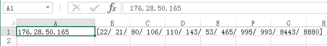
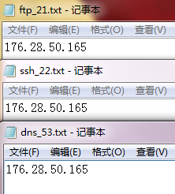
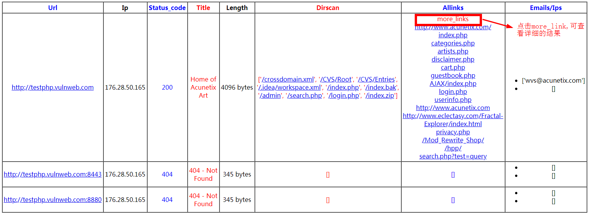

先公开1.0的版本，项目保存在[webmain1.0](https://github.com/cnnetarmy/SRCHunter/tree/webmain1.0)分支

1.0介绍：[web敏感资产fuzz](http://www.cnnetarmy.com/web%E6%95%8F%E6%84%9F%E8%B5%84%E4%BA%A7fuzz/)

关于1.0和2.0的区别请看[commit日志](https://github.com/cnnetarmy/SRCHunter/commits/master)

下面是2.0的介绍，暂不公开

## 目前支持的功能

```

单目标扫描：python webmain.py -u  http://127.0.0.1  -->  webscan Portscan && scanDir

多目标探测：python webmain.py -f  vuln_domains.txt  -->  webscan not scanDir

多目标扫描：python webmain.py -d  vuln_domains.txt  -->  webscan Portscan && scanDir

C段探测：  python webmain.py -cf 192.168.1.1       -->  C scan  not scanDir

C段扫描：  python webmain.py -cd 192.168.1.1       -->  C scan  Portscan && scanDir

```

## 项目地址

**Github**：https://github.com/cnnetarmy/SRCHunter

**运行环境**：python2.6.x或者python2.7.x

**依赖第三方库**：pip install requests[security]

## 程序介绍

**扫描参数不区分大小写和顺序**

**默认代理关闭**

**随机无序扫描验证**

**可跨平台使用**

### 单目标

单目标扫描模式默认，加载敏感资产和目录扫描功能，例如：http://testphp.vulnweb.com/

**命令**：`python webmain_debug.py -u http://testphp.vulnweb.com/`

**扫描日志**


**端口扫描**

程序只扫`11211`，`27017`和`小于10000`的端口

扫描结果如下：



程序会自动过滤掉常规端口



**扫描结果**


**结果介绍**



结果保存在**report**目录

### 多目标探测

**命令**：`python webmain_debug.py -f vuln_domains.txt`

**使用介绍**：

快速探测，实现url转ip后，进行部分端口扫描，并且对每一个开放的端口进行存活探测，

如果存活，进行`getitle`信息探测，小细节是加了个`filter_ports`，过滤掉常规端口，

考虑到一种情况(旁站)，多个url解析到一个ip上，程序加了`filter_ips`过滤已经扫描过端口的ip，

同时，如果各种非预期的情况导致扫描`scheme://netloc`重复，程序加入`filter_urls`过滤已经扫描过的任务，

程序还考虑到了一种情况，即：当url传过来的是存活，而且没有扫描出开放的端口，程序会自动探测default端口的信息，

包括另外一种情况，当url传过来的非存活，但是扫描出其他开放的端口，程序会自动探测相应端口的信息，

**程序仅端口扫描，获取目标站点title，状态码，返回值长度，包括可能存在的合法ip地址，email资产信息**，

但是`不探测解析到内网的ip`，黑名单列表如下：

```
10.x.x.x
127.x.x.x
172.x.x.x
192.168.x.x
```

### 多目标扫描

**命令**：`python webmain_debug.py -d vuln_domains.txt`

**使用介绍**：

与多目标探测不同的是，加入`敏感资产和目录扫描`，

敏感资产使用`常用payloads集合`进行探测，加上生成的`日期备份文件`，程序会先判断404页面的状态，然后对payloads进行遍历探测，

判断条件是返回200，且返回内容大小不等于0，且payload与404界面的返回大小差的绝对值大于5(或者直接两者返回大小不相等)，

程序改版了之前的附加判断条件`如果碰到waf，或者各种非预期的情况，导致跑的payloads返回大于40，这种情况程序会提示有可能碰到waf，并且返回空`，

进而增加`探针计数器`，计算结果个数，如果扫描结果很快超过25个，程序会直接结束此次扫描，节省时间，提高效率，

新增加`多级目录敏感资产扫描`，即在原来获取网页所有超链接的前提下，进行目录分割扫描，

关于结果中的`Dirscan`是`常用payloads集合扫描`和`多级目录敏感资产扫描`结果去重后的`并集`，

如果出现`['waf']`，表示`常用payloads集合扫描结果`达到程序设置的默认阀值，

如果出现`['more_path']`，表示`多级目录敏感资产扫描结果`达到程序设置的默认阀值，

其他的情况，可直接点击查看验证结果，

Allinks中，如果提示`[more_link]`，意味着页面存在`10`个以上的超链接，默认只显示`前25`个字符，直接点击，则可显示详情

### C段探测

**命令**：`python webmain_debug.py -cf 192.168.1.1`

**使用介绍**：

程序会判断输入ip的合法性，自动生成c段列表，其余同理多目标探测

### C段扫描

**命令**：`python webmain_debug.py -cd 192.168.1.1`

**使用介绍**：

与C段探测不同的是，加入`敏感资产和目录扫描`，其余同理多目标扫描

## 异常处理

总会有各种非预期的情况，导致程序产生异常告警，debug模式默认全部输出异常，正常模式不会输出，

以下是关于程序扫描过程中的异常处理，主要使用`write_file`进行错误日志记录，

- `write_file(ip,'portscan_error')`    记录单个目标扫描出开放90个端口以上的ip
- `write_file(url,'url2ip_error')`     记录单个目标未获取到ip的url
- `write_file(url,'output_error')`     记录保存文件时参数编码不合法的url

## 结果保存

默认在当前目录下，新建report目录，并且`根据扫描参数`分别保存为`html`文件，

关于扫描出开放的所有端口，`根据扫描参数`分别保存为`csv`文件，一些特殊端口保存为eg：`mysql_3306.txt`

异常处理保存

## bug反馈

QQ：`2069698797`

Email:`SRCHunter@cnnetarmy.com`
